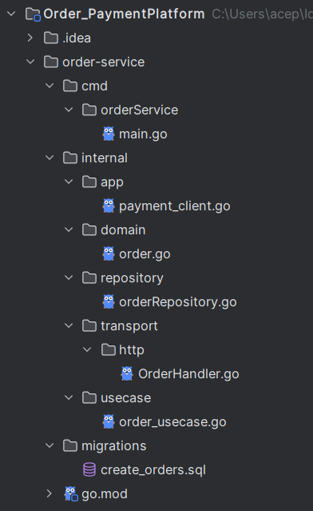
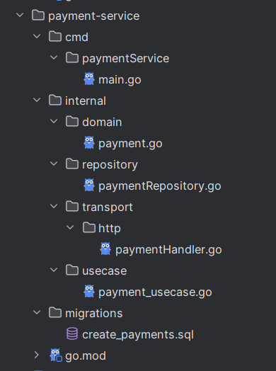
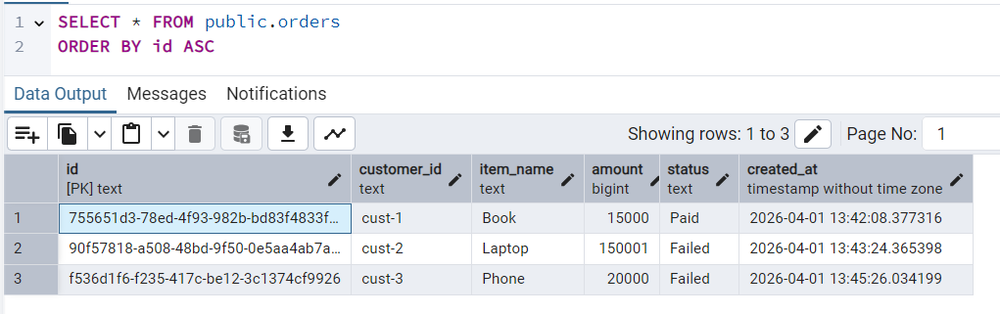
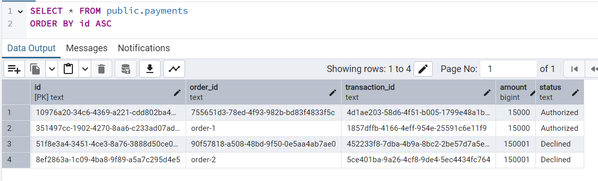
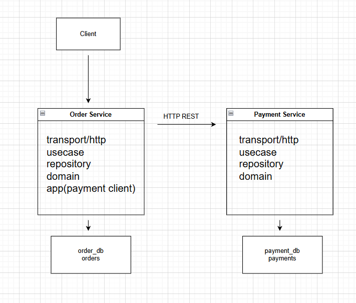

Order-Payment Platform

This is Order-Payment system that implements a simple microservices.
It demonstrates service decomposition, REST communication and failure handling.

The system consists of 2 independent services: Order and Payment.
And each of them has its own db and communicates via HTTP (request/response)

Architecture

Order Service - managing orders
Payment Service - payment authorization

cmd/ - Contains the entry point of the application (main.go), where all dependencies are initialized and the server is started.

internal/domain/ - Defines core business entities and data structures used across the service.

internal/usecase/ - Implements business logic and orchestrates operations between different layers.

internal/repository/ - Handles interaction with the database (CRUD operations).

internal/transport/http/ - Exposes HTTP endpoints and handles incoming client requests.

internal/app/ - Contains integrations with external services.

migrations/ - Stores SQL scripts used to create and manage database schema.

go.mod - Defines project dependencies and module configuration.

Services:
1. Order Service - handles - creating, retrieving, cancelling orders
Endpoints:
- POST /orders
- GET /orders/:id
- PATCH /orders/:id/cancel
2. Payment Service - handles - payment authorization, payment retrieval
Endpoints:
- POST /payments
- GET /payments/:order_id

When a new order is created, Order service sends request to Payment service.
If payment authorized the order becomes paid. If payment declined the order becomes failed.
If amount is less than 100000, payment is authorized. If amount more than 100000, payment is declined.

Failure Handling:

Order service uses 2 second timeout when calling payment service.
And if payment service unavailable, the order status becomes failed.

Only pending orders can be cancelled. Paid or failed orders cannot be canceled.

As a database I use PostgreSQl. And created two databases with tables.

order_db

payment_db

API Examples
1) Create Order

- POST /orders

{
"customer_id": "cust-1",
"item_name": "Book",
"amount": 15000
}
2) Create Payment (manual test)

- POST /payments

{
"order_id": "order-1",
"amount": 15000
}

Diagram

