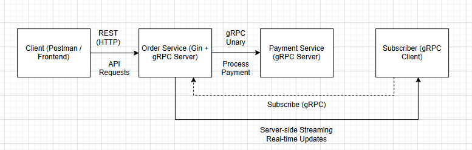
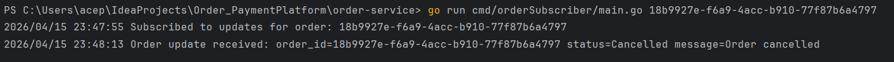

Order-Payment Platform

This is Order-Payment system that implements a simple microservices.
It demonstrates service decomposition, REST communication and failure handling.

The system consists of 2 independent services: Order and Payment.
And each of them has its own db and communicates via HTTP (request/response)

Architecture

Order Service - managing orders
Payment Service - payment authorization


cmd/ - Contains the entry point of the application (main.go), where all dependencies are initialized and the server is started.

internal/domain/ - Defines core business entities and data structures used across the service.

internal/usecase/ - Implements business logic and orchestrates operations between different layers.

internal/repository/ - Handles interaction with the database (CRUD operations).

internal/transport/http/ - Exposes HTTP endpoints and handles incoming client requests.

internal/app/ - Contains integrations with external services.

migrations/ - Stores SQL scripts used to create and manage database schema.

go.mod - Defines project dependencies and module configuration.

Services:
1. Order Service - handles - creating, retrieving, cancelling orders
Endpoints:
- POST /orders
- GET /orders/:id
- PATCH /orders/:id/cancel
2. Payment Service - handles - payment authorization, payment retrieval
Endpoints:
- POST /payments
- GET /payments/:order_id

When a new order is created, Order service sends request to Payment service.
If payment authorized the order becomes paid. If payment declined the order becomes failed.
If amount is less than 100000, payment is authorized. If amount more than 100000, payment is declined.

Failure Handling:

Order service uses 2 second timeout when calling payment service.
And if payment service unavailable, the order status becomes failed.

Only pending orders can be cancelled. Paid or failed orders cannot be canceled.

As a database I use PostgreSQl. And created two databases with tables.

order_db


payment_db


API Examples
1) Create Order

- POST /orders

{
"customer_id": "cust-1",
"item_name": "Book",
"amount": 15000
}
2) Create Payment (manual test)

- POST /payments

{
"order_id": "order-1",
"amount": 15000
}

Diagram
yes


# Assignment 2 - gRPC Migration & Contract-First Development

This project migrates internal communication between Order Service and Payment Service from REST to gRPC.
The Order Service keeps REST endpoints for external clients, while communication with the Payment Service is implemented using gRPC.
The project also follows a Contract-First workflow using separate repositories for `.proto` files and generated Go code.

Proto definitions:
- https://github.com/Aruzhan38/order-payment-protos

Generated code:
- https://github.com/Aruzhan38/order-payment-generated

## Architecture

- **Order Service**
   - Exposes REST API for external clients using Gin
   - Acts as a gRPC client for the Payment Service
   - Acts as a gRPC server for order update streaming

- **Payment Service**
   - Exposes a gRPC server
   - Processes payment requests from the Order Service

- **Subscriber**
   - Separate gRPC client that subscribes to order status updates from the Order Service

### Communication Flow

Client -> REST -> Order Service -> gRPC -> Payment Service  
Subscriber -> gRPC -> Order Service (server-side streaming)

## Diagram



## Contract-First Workflow

This project follows the Contract-First approach:

1. `.proto` files are stored in a dedicated repository.
2. GitHub Actions generates Go files (`.pb.go` and `_grpc.pb.go`) automatically.
3. Generated files are pushed to a separate generated-code repository.
4. Services import generated contracts as a Go dependency.

This simulates a shared contract environment between services.

## gRPC Contracts

### PaymentService
- `ProcessPayment(PaymentRequest) returns (PaymentResponse)`

### OrderService
- `SubscribeToOrderUpdates(OrderRequest) returns (stream OrderStatusUpdate)`

## Environment Variables

```env
ORDER_DB_DSN=host=localhost port=5432 user=postgres password=0000 dbname=order_db sslmode=disable
PAYMENT_DB_DSN=host=localhost port=5432 user=postgres password=0000 dbname=payment_db sslmode=disable
PAYMENT_GRPC_ADDR=localhost:50051
ORDER_GRPC_ADDR=localhost:50052
ORDER_HTTP_ADDR=:8080
```

How to run:
1. Clone repositories
2. Start Payment Service:
   go run cmd/paymentService/main.go

3. Start Order Service:
   go run cmd/orderService/main.go

4. Create an Order

Use Postman:

POST http://localhost:8080/orders

Example body:
```
{
"customer_id": "customer1",
"item_name": "TV",
"amount": 90000
}
```

5. Subscribe to Order Updates
   cd order-service
   go run cmd/orderSubscriber/main.go <ORDER_ID>

6. Cancel a Pending Order
   PATCH http://localhost:8080/orders/<ORDER_ID>/cancel

Generate protobuf
protoc --go_out=. --go-grpc_out=. --proto_path=. order/order.proto payment/payment.proto



## Bonus: gRPC Interceptor

A unary interceptor is implemented in the Payment Service to log:
- method name
- request duration
- error status